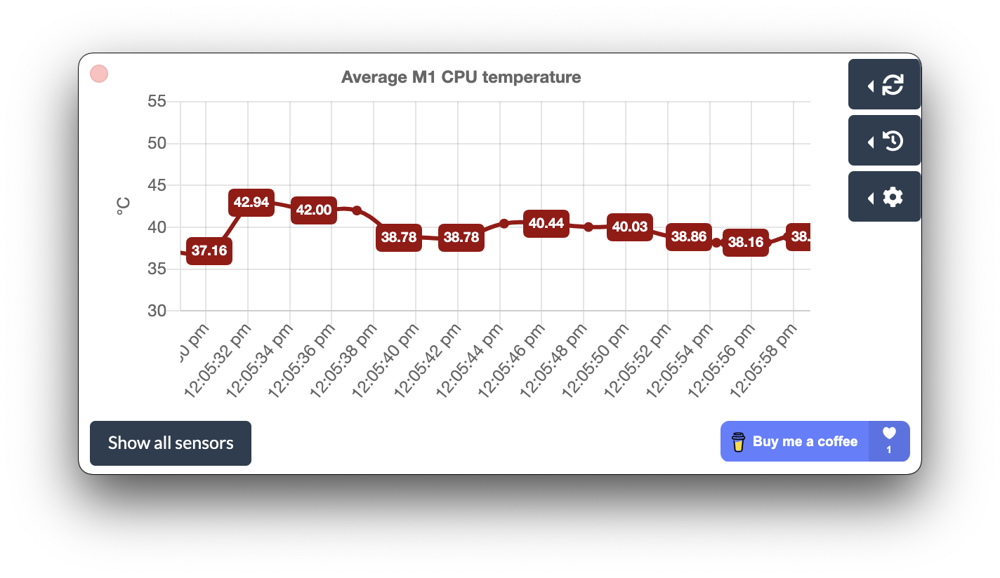
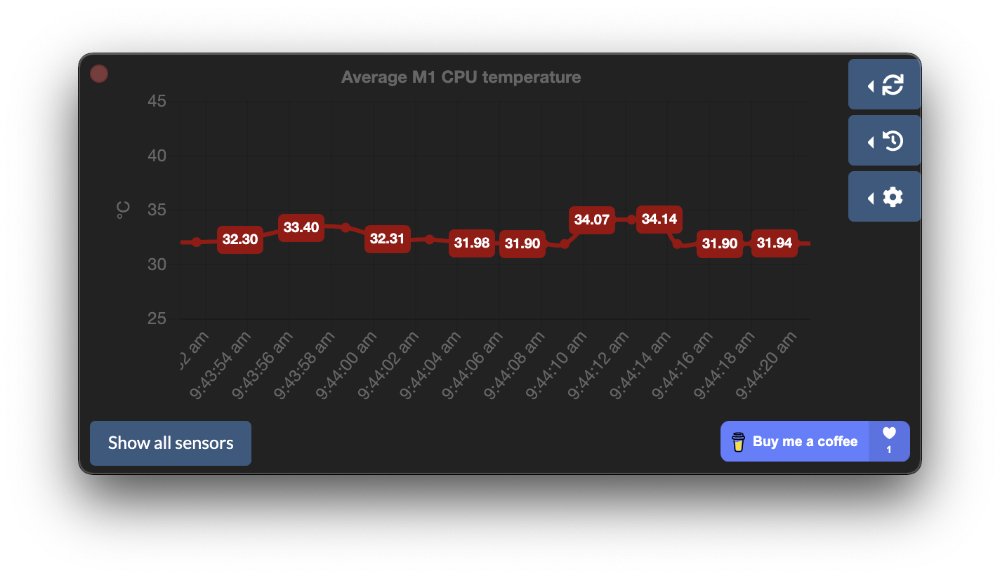
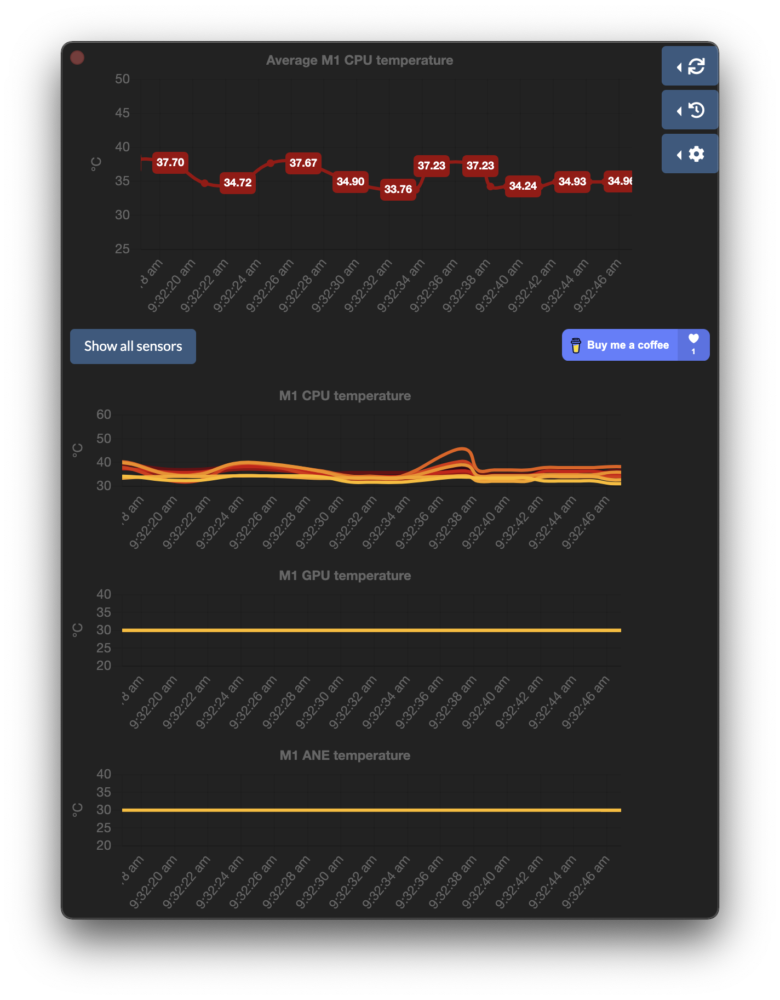
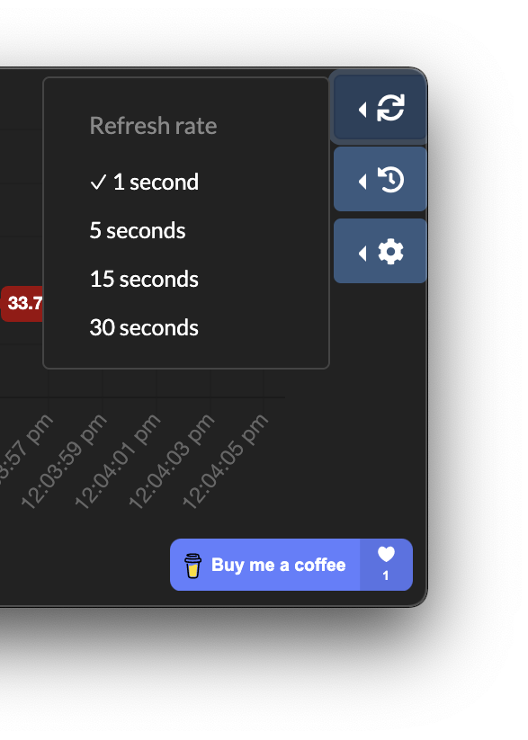
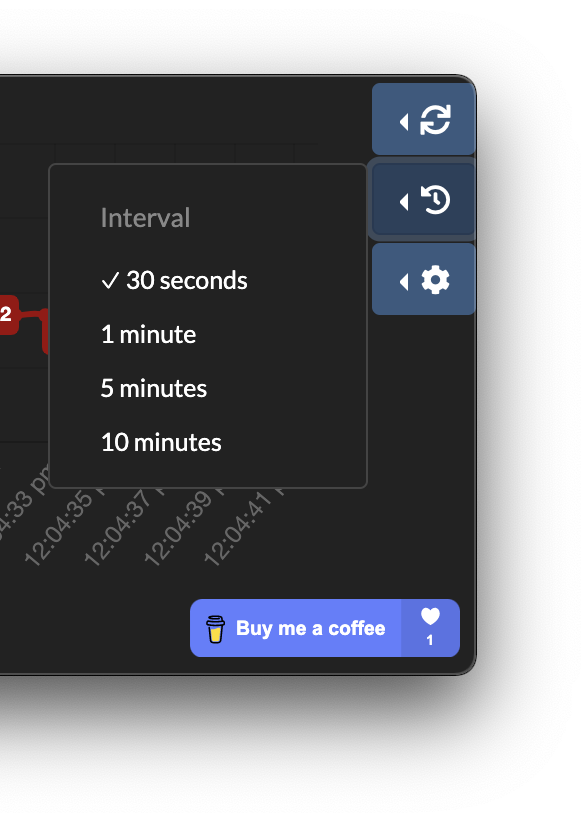
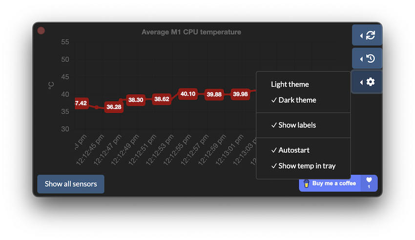

<h1 align="center">- coolm1 -</h1>

<h4 align="center">A simple temp monitoring utility for Apple M1</h4>

Using a modified version of [fermion-star's apple_sensors](https://github.com/fermion-star/apple_sensors).

## Info

- Made with [Electron](https://github.com/electron/electro) and [ChartJS](https://github.com/chartjs/Chart.js).

### Available options

- Sensor refresh rate
  

- Graph interval
  

- Light theme
- Dark theme
- Labels on graph
- Autostart
- Show temperature text in tray
  

## Functionality

- Average M1 SOC temperature
- Detailed temperature graphs for CPU, GPU and ANE

## Installing

- Download the latest version from [Releases](https://github.com/andreivdev/coolm1/releases)

## Building and running

`npm install`

`npm start`

## Packaging

`npm make`

Results of packaging can be found in `/out`

## Contributing

Feel free to make a PR 👍
